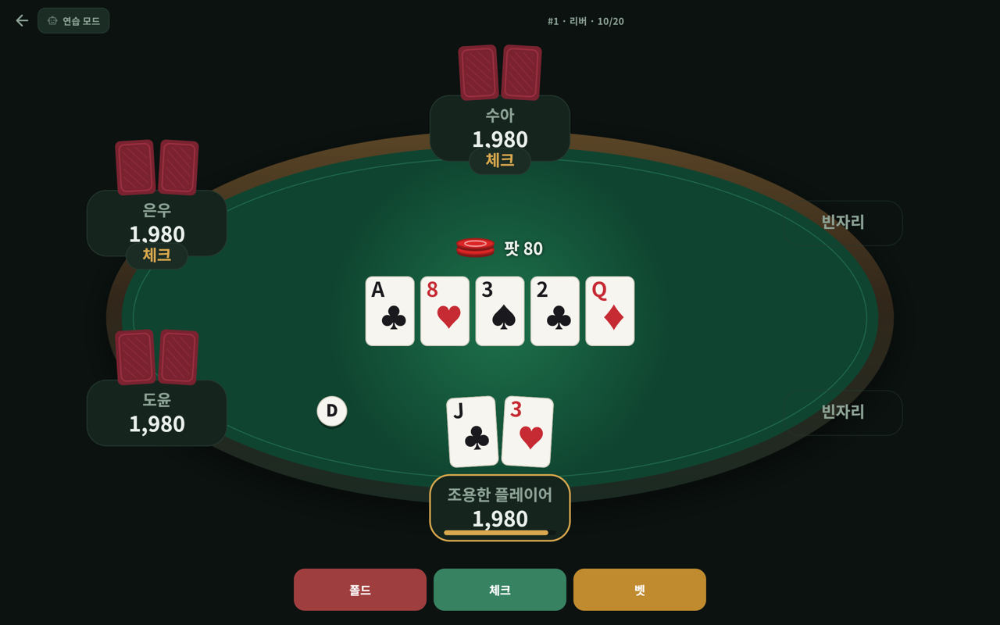
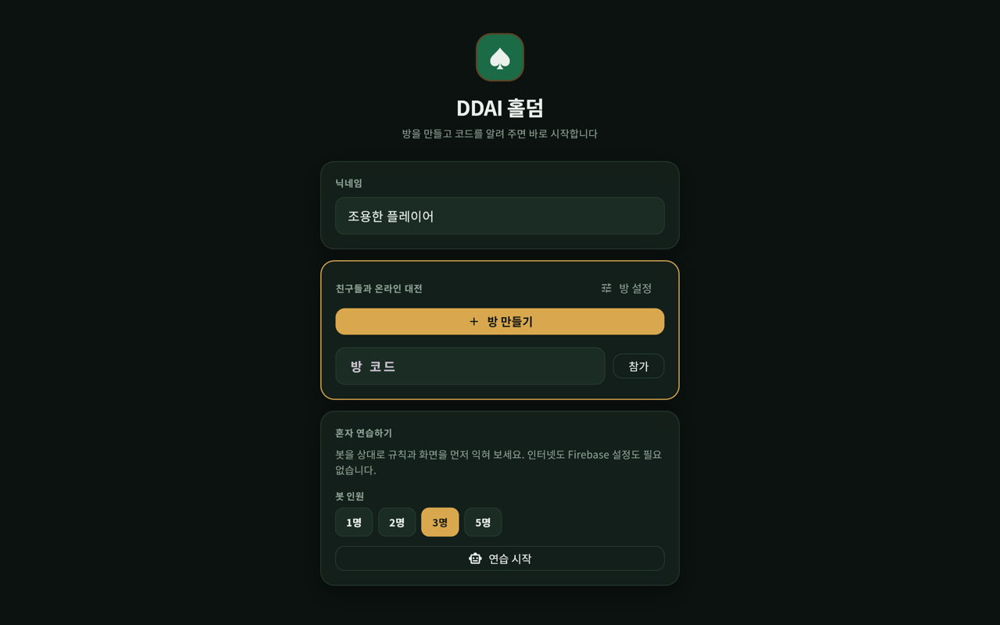
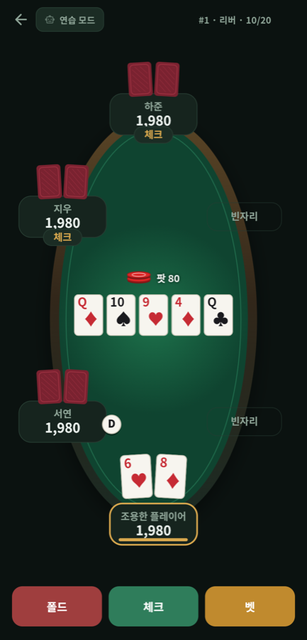

# DDAI 홀덤

친구들과 방 코드 하나로 즐기는 노 리밋 텍사스 홀덤.

**[지금 해보기 →](https://ddai-holdem.web.app)** 설치도 가입도 없이 브라우저에서 바로 열린다.



## 어떻게 노는가

1. 닉네임을 정하고 **방 만들기**를 누르면 `K3M9Q` 같은 다섯 자리 코드가 나온다.
2. 친구들에게 코드를 알려 준다. 첫 화면에 코드를 넣으면 빈자리에 앉는다.
3. 두 명 이상 모이면 방장이 **시작하기**를 누른다. 그다음부터는 한 판이 끝날 때마다
   알아서 다음 판이 돌아간다.



칩이 떨어져도 **리바이**로 다시 받는다. 돈이 오가지 않는 판이라 마음 놓고 올인해도
된다. 혼자라면 **연습 모드**로 봇을 상대할 수 있다 — 인터넷도 계정도 필요 없다.

## 무엇이 들어 있나

### 가장자리까지 맞춘 홀덤 규칙

홀덤은 자주 나오는 장면보다 가장자리가 까다롭다. 스택이 제각각일 때 팟을 어떻게
가르는지, 칩이 모자라 어중간하게 올린 올인 뒤에 앞사람이 다시 레이즈할 수 있는지
같은 것들이다. 이런 판정을 하나씩 테스트로 묶어 두었다.

- 2~9인 노 리밋 홀덤. 버튼과 블라인드가 돌고, 2인 헤즈업은 순서가 따로다
  (버튼이 스몰 블라인드이고 프리플랍에서 먼저 친다).
- 프리플랍에서 모두가 콜만 하고 돌아오면 빅 블라인드에게 선택권이 한 번 더 간다.
- **부족한 올인은 베팅을 다시 열지 않는다.** 이미 행동한 사람은 차액을 맞출 수는
  있어도 다시 올릴 수는 없다.
- 아무도 받아 주지 않은 베팅은 돌려준다. 300을 걸었는데 남은 사람이 100까지밖에
  못 따라왔다면 남는 200은 승부에 걸린 적이 없다.
- 메인 팟과 사이드 팟을 나눈다. 가져갈 사람이 같은 층은 하나로 합쳐 보여 준다.
- 무승부면 나눠 갖고, 나누어떨어지지 않는 칩은 버튼 왼쪽부터 한 칩씩 간다.
- 일곱 장에서 가장 센 다섯 장을 고른다. A-2-3-4-5도 스트레이트로 친다.

### 세로 폰에서도, 가로 데스크탑에서도

테이블을 그림 파일로 두지 않고 화면 비율을 보고 매번 타원을 새로 계산한다. 자리
이름표와 그 위로 고개를 내민 카드가 차지하는 만큼을 먼저 덜어 내고 남는 공간에
테이블을 앉히기 때문에, 어떤 비율에서도 자리가 화면 밖으로 잘리지 않는다. 내
자리는 언제나 화면 아래 가운데에 온다.



### 남의 카드는 볼 수 없다

각자의 홀 카드는 공개 문서에 아예 실리지 않는다. 본인 계정으로만 읽히는 자리에
따로 들어가고, 남은 덱은 방장만 읽는 문서에 남는다. 이 경계는 서버 규칙이
강제하므로, 앱을 고치거나 데이터베이스를 직접 들여다봐도 남의 패는 보이지 않는다.
[실제로 그런지 확인하는 스크립트](tool/verify_rules.py)도 함께 둔다.

## 만든 것

Flutter 한 벌로 Android · iOS · macOS · 웹에서 돈다. 테이블과 카드는
[Flame](https://docs.flame-engine.org) 게임 엔진으로 그리고, 버튼과 안내는 평범한
Flutter 위젯으로 얹었다. 이미지 에셋 없이 도형과 색으로만 그린다.

글꼴만은 앱에 넣어 둔다. Flutter 웹은 글꼴마저 구글 CDN에서 받아 오는데, 그동안은
글자가 통째로 비어 보이고 연결이 막히면 끝내 안 나온다. 한글로만 된 화면이라
치명적이라, 상용 2,350자만 남긴 Noto Sans KR을 굵기 두 벌(각 450KB)로 함께
넣었다.

친구들을 잇는 것은 Firebase(Firestore + 익명 인증)다. 별도 서버 없이 방장 기기가
규칙 판정을 맡는 구조라 무료 요금제 안에서 돌아간다. 홀덤 규칙 자체는 Flutter도
Firebase도 모르는 순수 Dart로 따로 떼어 두었다.

테스트 45개가 족보 판정, 베팅과 정산, 통신 계층, 화면 렌더링과 글꼴을 나눠 맡는다.

```sh
fvm flutter test
```

## 문서

| 문서 | 내용 |
|---|---|
| [개발 환경](docs/development.md) | 내려받아 돌려 보기, Firebase 설정, 플랫폼별 준비 |
| [설계](docs/architecture.md) | 누가 규칙을 판정하는가, 홀 카드를 지키는 방법, 폴더 구성 |
| [배포](docs/deployment.md) | 웹 호스팅, 보안 규칙 배포와 검증 |

## 알려진 제약

- **방장이 나가면 판이 멈춘다.** 방장이 다시 들어오면 돌리던 판을 이어 가지만,
  다른 사람에게 진행을 넘기는 기능은 아직 없다.
- 방 코드는 다섯 자리다. 코드를 아는 사람은 누구나 들어올 수 있다. 들어와도 남의
  홀 카드는 볼 수 없다.
- macOS에서 온라인 대전을 쓰려면 코드 서명 설정이 한 번 필요하다
  ([이유와 절차](docs/development.md#macos에서-온라인-대전-쓰기)). iOS · Android ·
  웹은 그냥 된다.
- 돈이 오가지 않는 친구끼리의 판을 전제로 만들었다. 모르는 사람과 붙이려면 진행을
  서버로 옮겨야 한다 ([설계](docs/architecture.md#진행을-누가-맡는가)).
